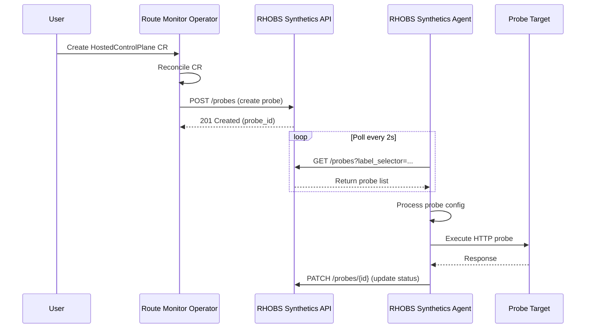

# Route Monitor Operator - E2E Test Suite

This directory contains two types of E2E tests for the Route Monitor Operator.

## Table of Contents
- [Cluster-Based E2E Tests](#cluster-based-e2e-tests) - Tests against a real OpenShift cluster
- [Full Integration Tests](#full-integration-tests) - Local tests without a cluster

---

## Cluster-Based E2E Tests

When updating your operator it's beneficial to add e2e tests for new functionality AND ensure existing functionality is not breaking using e2e tests.

### Running Tests Against a Real Cluster

To run tests against a deployed cluster, follow these steps:

1. **Build the E2E test binary**
   ```bash
   make e2e-binary-build
   ```

2. **Deploy your new version of operator in a test cluster**

3. **Install Ginkgo CLI**
   ```bash
   go install github.com/onsi/ginkgo/ginkgo@latest
   ```

4. **Get kubeadmin credentials from your cluster**
   ```bash
   ocm get /api/clusters_mgmt/v1/clusters/(cluster-id)/credentials | jq -r .kubeconfig > /(path-to)/kubeconfig
   ```

5. **Run the test suite**
   ```bash
   DISABLE_JUNIT_REPORT=true KUBECONFIG=/(path-to)/kubeconfig ./(path-to)/bin/ginkgo --tags=osde2e -v test/e2e
   ```

These tests (`route_monitor_operator_tests.go`) validate:
- Operator installation and deployment
- Resource creation (RouteMonitor, ServiceMonitor, PrometheusRule)
- Integration with running operator in a real cluster

---

## Full Integration Tests

This test validates the **complete end-to-end integration** between Route Monitor Operator (RMO), RHOBS Synthetics API, and RHOBS Synthetics Agent **without requiring Docker or a Kubernetes cluster**.

### Overview

The full integration test suite verifies the **complete workflow**:
1. **Route Monitor Operator** creates probes from HostedControlPlane CRs
2. **RHOBS Synthetics API** stores and serves probe configurations  
3. **RHOBS Synthetics Agent** fetches and processes probes

All three components run as **native Go processes** using:
- **Fake Kubernetes client** (no cluster needed)
- **Real RMO controller code** (imported as Go dependency)
- **Real RHOBS Synthetics API** (built from source automatically)
- **Real RHOBS Synthetics Agent** (built from source automatically)
- **Mock HTTP servers** for Dynatrace and probe targets

### Quick Start

#### Prerequisites

- Go 1.23+
- That's it! No Docker, no Kubernetes cluster needed

#### Running the Full Integration Test

```bash
# From project root (recommended)
make test-e2e-full

# Or using the script directly
cd test/e2e
./run-e2e.sh

# Or with go test directly from project root
go test -v -tags=e2e -timeout=5m ./test/e2e -run TestFullStackIntegration

# Or with go test from test/e2e directory
cd test/e2e
go test -v -tags=e2e -timeout=5m . -run TestFullStackIntegration
```

#### Expected Output

```
==============================================
Route Monitor Operator - Full E2E Test
==============================================

✓ Using RHOBS Synthetics API from Go module cache (automatic)

Running full integration test...

=== RUN   TestFullStackIntegration
    full_integration_test.go:45: Mock probe target server started at http://127.0.0.1:xxxxx
    full_integration_test.go:56: API server started at http://localhost:8081
=== RUN   TestFullStackIntegration/RMO_Creates_Probe_From_HostedControlPlane_CR
    full_integration_test.go:102: ✅ Created HostedControlPlane CR with cluster ID: test-e2e-cluster-456
    full_integration_test.go:108: 🔄 Triggering RMO reconciliation with actual controller code...
    full_integration_test.go:123: ✅ RMO log found: Reconciling HostedControlPlanes
    full_integration_test.go:129: ✅ RMO log found: Deploying HTTP Monitor Resources
    full_integration_test.go:135: ✅ RMO log found: Deploying RHOBS probe
    full_integration_test.go:146: ✅ RMO successfully created probe via API! Probe ID: abc-123
=== RUN   TestFullStackIntegration/API_Has_Probe_With_Valid_Status
    full_integration_test.go:160: ✅ Probe has valid status: pending
    full_integration_test.go:172: ✅ Probe has correct cluster-id label
=== RUN   TestFullStackIntegration/Cleanup_Probe
    full_integration_test.go:185: ✅ Successfully deleted probe abc-123
--- PASS: TestFullStackIntegration (5.23s)
PASS

==============================================
✅ All tests passed!
==============================================
```

### How It Works

#### 1. Automatic Dependency Resolution

The test automatically finds dependencies:
- **RHOBS Synthetics API**: Found in Go module cache (via `go list -m`)
- **Route Monitor Operator**: Already in local repository

```
Go Module Cache (automatic)
    ↓
Copy to /tmp (writable)
    ↓
Build API binary
    ↓
Run as Go process
```

#### 2. Test Architecture

```
┌─────────────────────────────────────────┐
│ Test Process (Go)                       │
├─────────────────────────────────────────┤
│                                         │
│  ┌────────────────────────────────┐    │
│  │ Fake Kubernetes Client         │    │
│  │  - HostedControlPlane CRs      │    │
│  │  - No real cluster needed      │    │
│  └──────────┬─────────────────────┘    │
│             │                           │
│             ▼                           │
│  ┌────────────────────────────────┐    │
│  │ RMO Controller (Real Code)     │    │
│  │  - Reconciles HostedControlPlan│    │
│  │  - Creates probes via API      │    │
│  └──────────┬─────────────────────┘    │
│             │                           │
│             │ HTTP POST /probes         │
│             ▼                           │
└─────────────┼───────────────────────────┘
              │
              ▼
┌─────────────────────────────────────────┐
│ RHOBS Synthetics API (Real Binary)      │
│  - Built from source                    │
│  - Runs as Go process                   │
│  - Local in-memory storage              │
│  - Port: 8081 (auto-selected)           │
└─────────────────────────────────────────┘
```

#### 3. No External Dependencies

- ❌ No Docker containers
- ❌ No Kubernetes cluster
- ❌ No external services
- ✅ Just Go processes and mock servers!

### Using Local RHOBS Synthetics API

To test with local API changes:

```bash
# Set environment variable
export RHOBS_SYNTHETICS_API_PATH=/absolute/path/to/rhobs-synthetics-api

# Run tests
make test-e2e-full
```

Or add to `go.mod` (remember to remove before committing):
```go
replace github.com/rhobs/rhobs-synthetics-api => /path/to/rhobs-synthetics-api
```

Then run: `go mod tidy && make test-e2e-full`

### Test Components

#### Files

- **`full_integration_test.go`** - Main test file (TestFullStackIntegration)
- **`api_manager.go`** - Manages RHOBS Synthetics API lifecycle (build, start, stop)
- **`agent_manager.go`** - Manages RHOBS Synthetics Agent lifecycle (build, start, stop)
- **`helpers.go`** - Helper functions for API calls, mocks, and setup
- **`run-e2e.sh`** - Convenient test runner script
- **`README.md`** - This file

#### Test Scenarios

1. **RMO Creates Probe From HostedControlPlane CR**
   - Creates HostedControlPlane CR in fake K8s
   - Runs actual RMO reconciler code
   - Verifies probe creation in RHOBS API
   - Validates RMO logs and behavior

2. **API Has Probe With Valid Status**
   - Retrieves probe from API
   - Validates probe configuration
   - Checks labels and status

3. **Agent Fetches And Executes Probe**
   - Starts RHOBS Synthetics Agent process
   - Agent polls API for probes
   - Verifies agent discovers and fetches probe
   - Validates agent integration

4. **Cleanup Probe**
   - Deletes probe via API
   - Verifies cleanup completed

### Troubleshooting

#### API Build Fails

```bash
# Check if API path is correct
ls $RHOBS_SYNTHETICS_API_PATH

# Try clearing module cache
go clean -modcache
go mod download

# Set explicit path
export RHOBS_SYNTHETICS_API_PATH=/absolute/path/to/rhobs-synthetics-api
```

#### Port Already In Use

The API manager automatically finds available ports (8081-8099). If all are in use:

```bash
# Check what's using the ports
lsof -i :8081-8099

# Kill processes if safe
kill <PID>
```

#### Tests Timeout

```bash
# Increase timeout (from project root)
go test -v -tags=e2e -timeout=10m ./test/e2e -run TestFullStackIntegration

# Or from test/e2e directory
cd test/e2e && go test -v -tags=e2e -timeout=10m . -run TestFullStackIntegration
```

#### Verbose Output

```bash
# Run with more verbose output (from project root)
go test -v -tags=e2e ./test/e2e -run TestFullStackIntegration 2>&1 | tee test-output.log

# Or from test/e2e directory
cd test/e2e && go test -v -tags=e2e . -run TestFullStackIntegration 2>&1 | tee test-output.log
```

### CI/CD Integration

Add to your CI pipeline:

```yaml
# GitHub Actions
- name: Run E2E Tests
  run: make test-e2e-full
  timeout-minutes: 10
```

```yaml
# GitLab CI
test:e2e:
  script:
    - make test-e2e-full
  timeout: 10m
```

### Development Workflow

#### Adding New Test Scenarios

1. Add new sub-test in `full_integration_test.go`:

```go
t.Run("My_New_Scenario", func(t *testing.T) {
    // Test implementation
})
```

2. Use helper functions from `helpers.go`:
   - `createProbeViaAPI()` - Create probe
   - `getProbeByID()` - Get probe
   - `listProbes()` - List probes with filters
   - `deleteProbeViaAPI()` - Delete probe

#### Debugging Tests

```go
// Add verbose logging in test
t.Logf("Debug info: %+v", someVariable)

// Check API manager logs
// Uncomment line 274 in api_manager.go:
fmt.Printf("[API %s] %s\n", prefix, scanner.Text())
```

### Comparison with Docker Approach

| Aspect | This Approach (PR #70) | Docker Approach |
|--------|----------------------|-----------------|
| **Setup** | `make test-e2e-full` | Install Docker, Docker Compose |
| **Dependencies** | Go only | Docker, Docker Compose, images |
| **Speed** | ~5-10 seconds | ~30-60 seconds (image pull + startup) |
| **Complexity** | Low (Go processes) | Medium (containers, networks) |
| **CI/CD** | Simple (just Go) | More complex (Docker-in-Docker) |
| **Debugging** | Easy (Go debugger) | Harder (container logs) |
| **Resource Usage** | Low | Higher (containers) |

### Using Local RHOBS Repositories

To test with local changes to any of the RHOBS components:

```bash
# The Makefile auto-detects sibling directories:
# - ../rhobs-synthetics-api
# - ../rhobs-synthetics-agent

# Or set explicit paths:
export RHOBS_SYNTHETICS_API_PATH=/absolute/path/to/rhobs-synthetics-api
export RHOBS_SYNTHETICS_AGENT_PATH=/absolute/path/to/rhobs-synthetics-agent

make test-e2e-full
```

Both the API and Agent use `replace` directives in `go.mod` to use local versions. These are already configured but can be updated:

```go
// go.mod
replace github.com/rhobs/rhobs-synthetics-api => ../rhobs-synthetics-api

replace github.com/rhobs/rhobs-synthetics-agent => ../rhobs-synthetics-agent
```

### Reference Documentation

#### Related Projects

- **RHOBS Synthetics API**: https://github.com/rhobs/rhobs-synthetics-api
- **RHOBS Synthetics Agent**: https://github.com/rhobs/rhobs-synthetics-agent  
- **Route Monitor Operator**: https://github.com/openshift/route-monitor-operator

#### Complete Integration Flow



#### API Documentation

##### RHOBS Synthetics API Endpoints

- `POST /probes` - Create new probe
- `GET /probes` - List probes (supports `?label_selector=key=value`)
- `GET /probes/{id}` - Get specific probe
- `PATCH /probes/{id}` - Update probe
- `DELETE /probes/{id}` - Delete probe

##### Probe Configuration Schema

```json
{
  "static_url": "https://api.cluster.example.com/livez",
  "labels": {
    "cluster-id": "cluster-123",
    "private": "true"
  }
}
```

#### Metrics Exposed

##### RHOBS Agent Metrics
- `probe_success` - Whether probe succeeded (0/1)
- `probe_duration_seconds` - How long probe took
- `probe_http_status_code` - HTTP status code returned

##### Blackbox Exporter Metrics
- `probe_http_duration_seconds` - HTTP probe duration by phase
- `probe_ssl_earliest_cert_expiry` - SSL certificate expiration timestamp

### FAQ

#### Q: Do I need a real Kubernetes cluster?

No! The test uses a fake Kubernetes client that simulates cluster behavior entirely in-memory.

#### Q: Can I run this on macOS with Apple Silicon?

Yes! The test works on any platform that supports Go (Linux, macOS Intel/ARM, Windows).

#### Q: How long do the tests take?

~5-10 seconds total including API build and test execution.

#### Q: Can I use this for local development?

Absolutely! That's the primary use case. Make changes to RMO, run `make test-e2e-full`, see results immediately.

#### Q: What if I want to test against specific versions?

Modify your `go.mod`:
```go
require github.com/rhobs/rhobs-synthetics-api v1.2.3
```
Or use a local replace directive as shown in "Using Local RHOBS Synthetics API" section.

#### Q: How do I add tests for custom CRDs?

1. Register your CRD scheme in `full_integration_test.go`
2. Create CR instances in the test
3. Run your reconciler against the fake client

#### Q: Can I run tests in parallel?

Currently tests run sequentially within `TestFullStackIntegration`. To parallelize:
```go
t.Run("Test1", func(t *testing.T) {
    t.Parallel()
    // test code
})
```

But be careful with shared resources (API server, ports).

#### Q: How do I integrate with my CI pipeline?

The test is CI-friendly since it requires no external services:

**GitHub Actions:**
```yaml
- name: Run E2E Tests
  run: make test-e2e-full
```

**GitLab CI:**
```yaml
test:
  script:
    - make test-e2e-full
```

### Support and Contributing

#### Getting Help

1. **Troubleshooting**: Check the [Troubleshooting](#troubleshooting) section
2. **Test Logs**: Run with `-v` flag for verbose output
3. **Reference**: Review [original PR #70](https://github.com/rhobs/rhobs-synthetics-agent/pull/70)
4. **Issues**: File issues on the Route Monitor Operator repository

#### Contributing

When adding new tests:
1. Follow existing test structure
2. Use helper functions in `helpers.go`
3. Add meaningful log messages with `t.Logf()`
4. Clean up resources in teardown
5. Update this README with new scenarios

#### Test Coverage Goals

Current coverage:
- ✅ RMO controller reconciliation logic
- ✅ HostedControlPlane CR processing
- ✅ Probe creation via RHOBS API
- ✅ API probe storage and retrieval
- ✅ Label-based filtering
- ✅ Probe lifecycle (create, read, delete)

Future enhancements:
- 🔄 More HostedControlPlane scenarios (different platforms, regions)
- 🔄 RMO controller error condition testing
- 🔄 Probe update and status change flows
- 🔄 Concurrent probe creation scenarios

---

## Summary

This directory provides two complementary approaches to E2E testing:

1. **Cluster-Based Tests** (`route_monitor_operator_tests.go`) - Traditional E2E tests requiring a real OpenShift cluster
2. **Full Integration Tests** (`full_integration_test.go`) - Modern approach testing the complete **RMO → API → Agent** workflow without cluster dependency

Choose the appropriate test suite based on your needs:
- Use **cluster-based tests** when validating operator deployment in real environments
- Use **full integration tests** for rapid local development and CI/CD pipelines

### Reference Implementation

The full integration test suite is based on the approach from [rhobs-synthetics-agent PR #70](https://github.com/rhobs/rhobs-synthetics-agent/pull/70), adapted and extended for the Route Monitor Operator repository.

Key features:
- Tests all three components: **RMO**, **RHOBS Synthetics API**, and **RHOBS Synthetics Agent**
- Uses RMO as the local repo (not imported as dependency)
- Builds both API and Agent from local source automatically
- Complete end-to-end workflow verification
- Includes mock Dynatrace and VpcEndpoint resources
- No Docker or Kubernetes cluster required

### Test Results

Example successful run:
```
=== RUN   TestFullStackIntegration
✅ RMO successfully created probe via API! Probe ID: 3282b976-ce1e-46a0-b51d-dd37fd8cf603
✅ Probe has valid status: pending
✅ Agent successfully fetched probe from API
✅ Agent integration verified - it can discover and fetch probes from the API!
--- PASS: TestFullStackIntegration (26.48s)
    --- PASS: TestFullStackIntegration/RMO_Creates_Probe_From_HostedControlPlane_CR (1.02s)
    --- PASS: TestFullStackIntegration/API_Has_Probe_With_Valid_Status (0.00s)
    --- PASS: TestFullStackIntegration/Agent_Fetches_And_Executes_Probe (21.21s)
    --- PASS: TestFullStackIntegration/Cleanup_Probe (0.00s)
PASS
```

---

## License

This test suite follows the same license as the Route Monitor Operator project.

---

**Last Updated**: November 2025  
**Pattern**: Based on rhobs-synthetics-agent PR #70  
**Dependencies**: Go 1.23+, no Docker or Kubernetes cluster required
